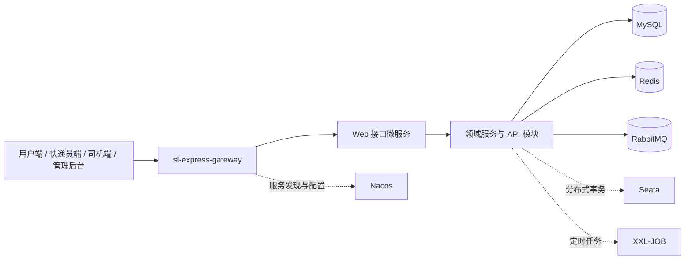

# 物流智能调度系统

物流智能调度系统是一个面向快递业务的运输管理系统（TMS）示例项目，包含订单、运单、取派件、运输调度、轨迹查询和后台运营等业务。仓库同时收录 Java 微服务后端、管理后台、移动端工程以及配套的课程和产品资料，适合用于微服务架构学习、业务建模和全链路联调。

> 当前仓库面向个人学习与二次开发。源码中的本地开发配置仅用于示例，部署前必须替换服务地址、账号、密钥和第三方服务配置。

## 功能概览

- **用户端**：寄件下单、地址簿、订单支付、物流轨迹和签收/拒收。
- **快递员端**：取件与派件任务、扫码收款、任务搜索和消息通知。
- **司机端**：运输任务、提货、在途上报、异常上报和到达确认。
- **管理后台**：组织机构、员工、车辆、线路、作业范围、排班、订单、运单和运输任务管理。
- **平台能力**：统一网关、服务注册与配置、消息事件、分布式事务、缓存、任务调度和文件存储。

## 架构



后端采用 Spring Boot + Spring Cloud Alibaba 的微服务体系，按 API、Domain、Service 和 Web 层拆分业务边界。服务通过 Nacos 进行注册发现和配置管理，跨服务事件使用 RabbitMQ，数据访问主要使用 MyBatis-Plus。

## 技术栈

| 层次 | 主要技术 |
| --- | --- |
| 后端 | Java 11、Spring Boot 2.6、Spring Cloud 2021、Spring Cloud Alibaba |
| 服务治理 | Nacos、Spring Cloud Gateway、OpenFeign、LoadBalancer |
| 数据与消息 | MySQL 8、Redis/Redisson、RabbitMQ、MyBatis-Plus |
| 分布式能力 | Seata、XXL-JOB、JWT、Knife4j |
| 管理后台 | Vue 2、Vue CLI、Element UI、ECharts |
| 移动端 | Uni-app、Vue 3、HBuilderX |
| 工程化 | Maven、npm/yarn、Docker（各服务提供 Dockerfile） |

## 目录结构

| 路径 | 说明 |
| --- | --- |
| `sl-express-parent` | Maven 依赖管理和公共构建配置 |
| `sl-express-common`、`sl-express-mq`、`sl-express-pay`、`sl-express-sdn` | 公共组件、消息、支付和基础能力 |
| `sl-express-gateway` | API 网关、路由和鉴权过滤器 |
| `sl-express-ms-*-api` | 各业务域的 Feign/API 契约 |
| `sl-express-ms-*-domain` | 各业务域的领域模型与持久化对象 |
| `sl-express-ms-*-service` | 业务服务和领域实现 |
| `sl-express-ms-web-*` | 面向四端的接口聚合层 |
| `sl-express-xxl-job` | XXL-JOB 相关任务模块 |
| `project-slwl-admin-vue` | Vue 管理后台 |
| `project-wl-*-uniapp-vue3` | 用户端、快递员端和司机端移动工程 |
| `01-讲义`、`03-资料` | 学习讲义、产品文档和流程素材 |
| `sentinel` | Sentinel 源码及相关示例模块 |

## 环境要求

后端：

- JDK 11
- Maven 3.6+
- 可访问 Maven Central 或项目所需的镜像仓库
- Nacos、MySQL 8、Redis、RabbitMQ、Seata 和 XXL-JOB
- 如启用权限、地图、对象存储或短信能力，还需要对应的外部服务和凭据

前端：

- 管理后台建议使用 Node.js 14.x（Vue 2、`node-sass` 等旧依赖对 Node 版本较敏感）
- 管理后台使用 npm 或 yarn；移动端建议使用 HBuilderX 打开对应目录
- 微信小程序、Android 或地图能力需要在各平台配置 App ID、签名和服务密钥

## 后端启动

仓库目前以多个独立 Maven 模块组织，未提供根目录聚合 POM。推荐按下面顺序操作：

```bash
# 1. 安装公共 parent（子模块的 parent 版本以各模块 pom.xml 为准）
cd sl-express-parent
mvn clean install -DskipTests

# 2. 编译并启动需要的服务，例如网关
cd ../sl-express-gateway
mvn clean package -DskipTests
mvn spring-boot:run -Dspring-boot.run.profiles=local
```

各业务服务均可在自己的目录执行相同的 Maven 命令。启动前请完成以下工作：

1. 启动 Nacos，并准备服务所需的命名空间、用户和共享配置。
2. 在 Nacos 中配置 `shared-spring-mysql.yml`、`shared-spring-redis.yml`、`shared-spring-rabbitmq.yml`、`shared-spring-seata.yml` 等共享配置。
3. 初始化业务数据库、Seata 和 XXL-JOB 所需的数据表。
4. 根据环境选择 `bootstrap-local.yml`、`bootstrap-test.yml`、`bootstrap-stu.yml` 或 `bootstrap-prod.yml`，并替换其中的地址和凭据。
5. 最后启动网关和对应的 Web/业务服务，使用网关路由访问四端接口。

不要把真实密码、私钥、对象存储密钥或生产环境地址提交到 Git。建议通过 Nacos、环境变量或部署平台的 Secret 注入这些配置。

## 前端启动

### 管理后台

```bash
cd project-slwl-admin-vue
npm install
npm run dev
```

生产构建：

```bash
npm run build:prod
```

### 移动端

`project-wl-yonghuduan-uniapp-vue3`、`project-wl-kuaidiyuan-uniapp-vue3` 和 `project-wl-siji-uniapp-vue3` 是 Uni-app 工程。使用 HBuilderX 打开对应目录，选择运行到浏览器、模拟器或真机；发布小程序和 APK 前，请先在 `manifest.json` 及各端环境文件中配置自己的应用信息。

## 配置说明

后端服务的 `bootstrap-*.yml` 主要负责端口、Nacos 地址、命名空间和共享配置引用；业务数据库、缓存、消息队列和权限服务的连接信息通常来自 Nacos。建议为每个环境建立独立命名空间，并将敏感值放在 Secret 管理系统中。

网关默认按以下前缀转发请求：`/courier`、`/customer`、`/driver`、`/manager`。实际端口和路由以当前环境配置为准。

## 开发规范

- 提交前运行目标模块的 `mvn test` 或 `mvn package -DskipTests`，并执行前端 lint。
- 提交信息使用简短、可检索的动词开头，例如 `feat: add route query`、`fix: handle empty task`、`docs: update setup guide`。
- 不提交 `target/`、`node_modules/`、IDE 配置、临时文件、日志和本地环境覆盖文件。
- 新增配置时同时提供无敏感信息的示例，并在 README 中说明必填项。
- 业务代码、课程资料和第三方源码的许可证边界不同，修改或发布前请确认对应目录的许可证文件和来源说明。

## 测试与已知限制

该仓库依赖多项外部基础设施，无法在没有 Nacos、数据库、消息队列等服务的环境中完成完整端到端启动。当前根目录也没有统一的 Maven reactor，因此建议按服务模块逐个验证。提交前应至少完成：

- 目标 Java 模块的编译或单元测试；
- 管理后台的 lint 和生产构建；
- 移动端在目标运行平台的打包检查；
- 配置中不存在真实凭据和生产数据。

## 许可证与第三方声明

本项目可授权的原创代码采用 [MIT License](./LICENSE)。`project-slwl-admin-vue`、`sentinel`、课程资料和其他第三方组件可能包含各自的许可证、版权声明或使用限制；这些内容不因本仓库采用 MIT 而改变，使用、修改或再发布时请遵循对应目录中的要求。

## 维护信息

本仓库的 Git 远程地址为 [`lfeternity/sl-express`](https://github.com/lfeternity/sl-express)。问题反馈和改进建议请通过 GitHub Issues 提交，并附上模块、运行环境、复现步骤和相关日志。
